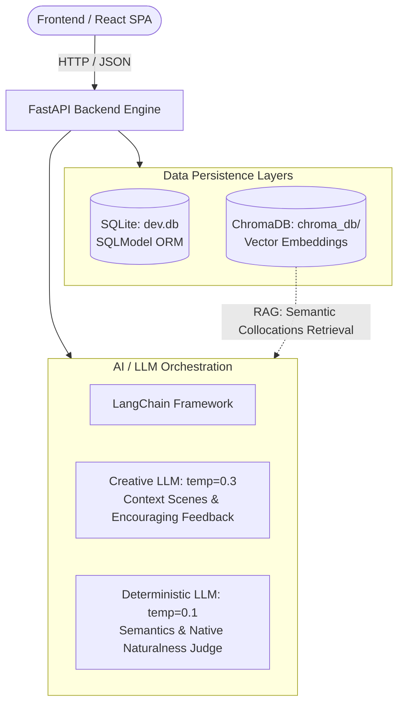

# UsedIt Backend Architecture & Vector DB Deep Dive

This document provides a comprehensive technical overview of the UsedIt backend architecture, data persistence layers, and **Large Language Model (LLM) engineering practices**, with a particular focus on **what the Vector Database (ChromaDB) does and why it is indispensable**.

> 🇨🇳 **Looking for the Chinese version?** See [docs/BACKEND_AND_AI_TECH_CN.md](./BACKEND_AND_AI_TECH_CN.md).

---

## 🧭 Architecture Overview



---

## 🔍 1. Why a Vector Database (ChromaDB)?

### The Problem with Traditional Relational Queries
In traditional SQL databases (like SQLite or PostgreSQL), querying sentences containing a target word relies on substring pattern matching:
```sql
SELECT * FROM sentences WHERE text LIKE '%eloquent%';
```
While this works for exact string matching, it completely fails to support intelligent language learning:
1. **No Semantic Awareness**: A SQL query cannot understand context, tone, formality, or grammatical nuances. It treats any sentence containing the letters identically.
2. **Cannot Power RAG (Retrieval-Augmented Generation)**: When a learner creates an unnatural or awkward sentence, the LLM needs to reference authentic, native-speaker examples of that word being used *in similar social or semantic contexts* to formulate a realistic rewrite. Simple string matching yields arbitrary or irrelevant examples.

### How ChromaDB Solves This
Vector databases store textual information as **dense numerical vectors (embeddings)** in high-dimensional space:
- **Semantic Projection**: Sentences with similar meanings, contextual usage, and grammatical patterns are positioned close to one another in vector space (high cosine similarity).
- **Approximate Nearest Neighbor (ANN) Search**: ChromaDB can query by semantic concept or target word in milliseconds, retrieving authentic examples that share the appropriate stylistic register and collocations.

### Key Use Cases of ChromaDB in UsedIt

#### 1. Real-World Collocations in Word Details (`GET /words/{id}`)
When a user opens a word in the library, the backend queries ChromaDB:
```python
collection = chroma_client.get_collection(name="vocab-examples")
results = collection.query(query_texts=[dictionary_entry.text], n_results=3)
collocations = results["documents"][0]
```
Rather than synthetic dictionary snippets, the learner immediately sees **authentic collocations** extracted from real-world datasets (Tatoeba corpus), accelerating context retention.

#### 2. RAG-Enhanced AI Feedback & Sentence Rewriting (`POST /practice/{id}/judge`)
When a student submits a sentence that has correct semantics but awkward phrasing (`Slightly Off` or `Awkward`), UsedIt triggers **RAG**:
1. **Vector Retrieval**: ChromaDB retrieves 3 authentic reference sentences exhibiting natural collocations of the word.
2. **Context Injection**: These real-world sentences are injected into the LLM system prompt as reference ground truth.
3. **High-Fidelity Rewriting**: The LLM constructs an accurate, natural alternative sentence specifically adapted to the user's conversational scene.

### Data Ingestion Pipeline
The vector store is populated through an offline data pipeline (`backend/scripts/automation_pipeline.py`):
```text
Raw Corpus (data/raw/eng_sentences.tsv)
  └─► Length & Quality Filtering (15-150 chars)
        └─► Tokenization & Word Mapping (data/processed/word_examples.csv)
              └─► Persistent Embedding Storage (backend/data/chroma_db/ [vocab-examples])
```

---

## 🧠 2. LLM Engineering & Prompt Architecture

The evaluation and generation pipeline in `backend/app/routers/practice.py` incorporates several production-grade LLM design patterns:

### 1. Dual-LLM Temperature Architecture
A single LLM temperature cannot satisfy both creative role-playing and rigorous grammar grading. UsedIt separates them into two decoupled models:
- **Creative Generator (`llm`, `temperature=0.3`)**: Powers scenario generation (`GET /practice/{id}/scene`). Introduces realistic variety across characters (coworkers, managers, friends, doctors) while remaining coherent.
- **Deterministic Judge (`judge_llm`, `temperature=0.1`)**: Powers grammar and semantic judgment (`judge_meaning`, `judge_naturalness`). Minimizes token sampling entropy to guarantee reproducible, fair evaluations.

### 2. Structured Outputs with Pydantic & LangChain
Instead of fragile regex parsing or unvalidated JSON text, UsedIt uses LangChain's `.with_structured_output()` bound to strict Pydantic schemas:
- `SceneOutput`: Enforces reasoning behind the context and short conversational prompts.
- `MeaningJudgment`: Validates core meaning, part-of-speech, and syntax with discrete ratings (`Correct`, `Close`, `Incorrect`).
- `NaturalnessJudgment`: Evaluates native phrasing quality (`Native`, `Slightly Off`, `Awkward`).
- `FeedbackOutput`: Generates concise coaching feedback and a corrected example sentence.

### 3. Anti-Bias & Few-Shot Calibration
Lightweight models (such as Llama 3.1 8B) tend to suffer from cognitive biases: being overly lenient on common words and overly critical of advanced vocabulary. UsedIt mitigates this via explicit prompt calibration:
- **Strict Anti-Bias Rule**: The prompt explicitly enforces the exact same grading standard regardless of word frequency or difficulty level.
- **Simplicity != Awkwardness**: Prompts calibrate short sentences (e.g., `"The soup is thin"`) as `Native`, stopping the model from penalizing brevity or demanding needlessly complex prose.
- **Anchor Few-Shot Calibration**: Concrete examples for `Native`, `Slightly Off`, and `Awkward` establish rigid classification boundaries.

### 4. Cascaded Multi-Stage Evaluation Pipeline
Rather than asking the LLM to grade everything in a single prompt, UsedIt executes a hierarchical evaluation:
```text
User Submits Sentence
       │
       ▼
[Stage 1: Semantic & Grammatical Judgment (judge_meaning)]
       ├─ Incorrect Sense / Broken Syntax ──► Early exit with targeted correction
       ▼ (Valid Meaning)
[Stage 2: Native Phrasing Judgment (judge_naturalness)]
       ├─ Unnatural / Stiff Phrasing ──► Query ChromaDB ──► RAG Native Rewrite
       ▼ (Natural)
[Stage 3: Policy Arbitration (_determine_passed)]
       └─ Evaluate against user's strictness setting (Lenient / Normal / Strict)
```

### 5. Defensive Self-Healing Retries & Sanitization
- **Artifact Cleansing (`_has_json_artifacts`)**: Automatically detects escaped JSON symbols or leaked prompt tokens, rejecting compromised completions.
- **Retry Mechanism**: Critical generation steps retry up to 3 times (`for attempt in range(3)`) if outputs fail structural assertions.
- **Spoiler Prevention**: Asserts that generated scenes do not inadvertently leak the target vocabulary word before the user attempts it.

---

## 🏛️ 3. Two-Tier Relational Database Design (SQLite + SQLModel)

Rather than redundantly duplicating word definitions for every user, UsedIt implements a two-tier relational schema:

```text
[Dictionary (Global Shared Cache)] ── (1:N) ── [UserWord (User Learning Relationship)]
  • Stored once across all users                 • user_id (Owner)
  • Definitions, phonetics, audio URLs           • status (NEW / PRACTICING / MASTERED)
  • Etymology, difficulty, memory aids           • Created timestamp
  • Synonyms, antonyms                                   │ (1:N)
                                                         ▼
                                                [PracticeSession (Attempt Logs)]
                                                  • Context scene
                                                  • User input sentence
                                                  • AI evaluation & feedback
                                                  • passed (true / false)
```

### Advantages
1. **Computational & API Efficiency**: When any user adds a word, it is enriched with definitions and linguistic metadata exactly once. Future users who add the same word reuse this shared entry instantly.
2. **Fast Paginated Queries**: User word lists (`GET /words`) only scan lightweight foreign key relationships, achieving sub-millisecond query execution.
3. **Zero Maintenance**: SQLite (`backend/data/dev.db`) operates as an embedded file database. Tables are automatically created during FastAPI's `lifespan` startup hook without requiring external database servers or Docker containers.

---

## 🔐 4. Authentication & Security

- **Password Security**: Passwords are cryptographically salted and hashed using `bcrypt` (never stored as plain text).
- **Stateless Session Tokens**: Authenticated sessions issue signed JSON Web Tokens (JWT) with standard 7-day expiration (`HS256`).
- **OAuth 2.0 Integration**: Supports Google OAuth via Authlib and Starlette `SessionMiddleware`, automatically registering new users upon their first Google sign-in.
- **Tenant Isolation**: All word and session queries strictly filter by `current_user.id` resolved via FastAPI's dependency injection (`Depends(get_current_user)`).

---

## 📊 5. Summary of Tech Stack Synergy

| Component | Technology | Primary Role in UsedIt |
| :--- | :--- | :--- |
| **Vector DB** | ChromaDB | Supplies real-world collocations and grounds RAG sentence rewriting |
| **LLM Orchestration** | LangChain + Ollama | Delivers offline, low-latency, privacy-first sentence generation & feedback |
| **Relational DB** | SQLite + SQLModel | Manages multi-user isolation with a cached global dictionary design |
| **Web API** | FastAPI | High-concurrency async endpoints with automated OpenAPI (Swagger) documentation |
| **Frontend** | React 19 + Vite + Tailwind | Modern, animated SPA interface with optimistic state updates |
