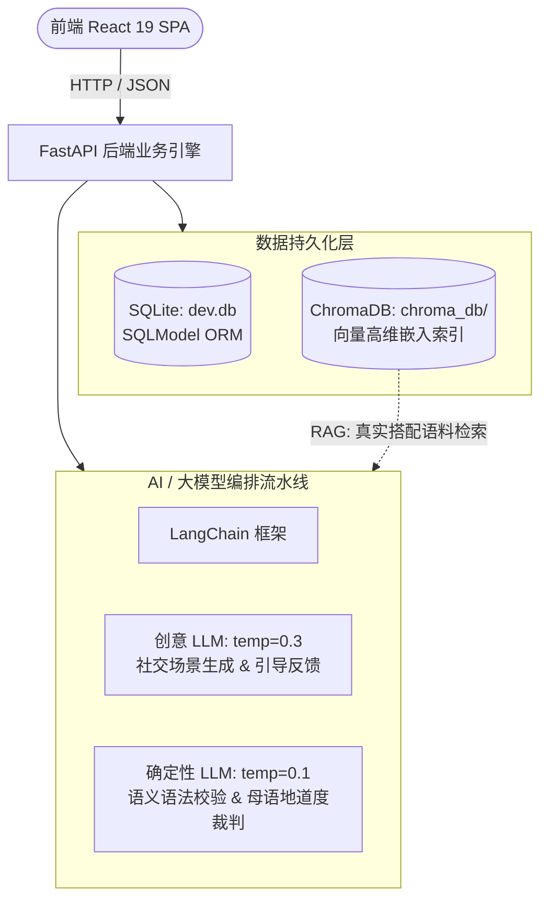

# UsedIt 后端架构与向量数据库 (Vector DB) 深度解析

本文档全面剖析 UsedIt 后端的核心技术架构、数据持久化方案以及**大模型工程（LLM Engineering）实践**，重点解析**向量数据库（ChromaDB）在本项目中的必要性与具体作用**，以及各技术模块如何协同为用户提供高质量的语境词汇学习体验。

> 🌐 **Looking for the English version?** Please see [docs/BACKEND_AND_AI_TECH.md](./BACKEND_AND_AI_TECH.md).

---

## 🧭 核心架构全景图



---

## 🔍 一、为什么需要向量数据库 (ChromaDB)？

### 1. 传统关系型数据库模糊匹配的局限
在传统 SQL 数据库（如 SQLite 或 PostgreSQL）中，查找包含某个单词的例句只能使用字符串匹配：
```sql
SELECT * FROM sentences WHERE text LIKE '%eloquent%';
```
这种方式在面向“语境词汇学习”的应用中存在明显的硬伤：
1. **毫无语义感知能力**：SQL 查询无法理解句子的上下文基调、说话人身份、正式程度或语法搭配。只要包含字符拼写就算匹配，返回的例句往往生硬、过时或语义脱节。
2. **无法支撑 RAG（检索增强生成）**：当学生写出结构生硬、缺乏母语者语感的句子时，大模型需要参考**母语者在真实世界中如何地道使用该词的典型句式**。传统匹配返回的随机句子无法为大模型提供高质量的改写锚点。

### 2. 向量数据库的破局之道
向量数据库将文本转化为高维密集向量（Dense Embeddings）：
- **几何语义投影**：语义相近、搭配地道的句子在几何向量空间中的距离更近（高余弦相似度）。
- **近似最近邻检索（ANN）**：ChromaDB 能够在毫秒级内从数万条英文真实例句中，快速召回在**用法、搭配与语境风格上最贴近**的地道例句。

### 3. ChromaDB 在 UsedIt 中的两大核心应用场景

#### 场景 1：单词详情页的“真实世界母语搭配展示” (`GET /words/{id}`)
当用户打开某个单词的词库详情时，后端直接查询 ChromaDB：
```python
collection = chroma_client.get_collection(name="vocab-examples")
results = collection.query(query_texts=[dictionary_entry.text], n_results=3)
collocations = results["documents"][0]
```
- **价值**：学习者看到的不是生硬死板的词典例句，而是从海量母语真实语料库（Tatoeba 数据集）中提取的高频原生搭配，快速建立语感直觉。

#### 场景 2：RAG 驱动的 AI 造句纠错与母语级重构 (`POST /practice/{id}/judge`)
当用户在互动练习中写出的句子**词义基本正确但表达不够地道（Slightly Off 或 Awkward）**时，系统会触发 **RAG（检索增强生成）**：
1. **向量检索**：从 ChromaDB 中精准提取 3 条母语者的原生优质搭配例句；
2. **上下文注入**：将这 3 条地道语料作为参考上下文注入到大模型的 Prompt 中；
3. **高质量改写**：LLM 参照真实的语料风格，为用户在当前社交场景下生成一条符合母语者习惯的重构例句（Example Sentence）。

### 4. 向量数据清洗与持久化管道 (Pipeline)
语料库通过自动化离线脚本 (`backend/scripts/automation_pipeline.py`) 完成处理与向量化：
```text
原始海量语料 (data/raw/eng_sentences.tsv)
  └─► 长度与质量过滤 (15 ~ 150 字符，剔除碎片与超长句)
        └─► 目标词分词匹配与去重 (data/processed/word_examples.csv)
              └─► ChromaDB 向量化持久化 (backend/data/chroma_db/ [集合: vocab-examples])
```

---

## 🧠 二、大模型工程实践 (LLM Engineering)

在 `backend/app/routers/practice.py` 中，封装了一整套工业级大模型落地技术：

### 1. 双模型温度解耦架构 (Dual-LLM Temperature Separation)
单一模型温度参数无法兼顾“场景创造力”与“判卷确定性”，UsedIt 将模型拆分为两个独立逻辑实例：
- **创意生成模型 (`llm`, `temperature=0.3`)**：用于生成多变的日常交际场景 (`GET /practice/{id}/scene`)，涵盖同事、朋友、面试官、医生等多重社会角色，并输出鼓励性的提示。
- **确定性判卷裁判 (`judge_llm`, `temperature=0.1`)**：用于语义与地道度判定。极低的温度最大程度降低了采样随机性，确保同一句子无论何时提交都能获得公正、稳定的评分。

### 2. Pydantic 强类型结构化输出 (Structured Outputs)
彻底告别脆弱的正则表达式解析或裸 JSON 文本提取，利用 LangChain 的 `.with_structured_output()` 强制模型遵循 Pydantic Schema：
- `SceneOutput`：情景设定与社交推理原因；
- `MeaningJudgment`：核心词义与语法判定，输出离散状态（`Correct`, `Close`, `Incorrect`）；
- `NaturalnessJudgment`：母语地道度分析与等级（`Native`, `Slightly Off`, `Awkward`）；
- `FeedbackOutput`：指导建议与针对当前场景的修正例句。

### 3. 少样本标定与反偏见工程 (Few-Shot Calibration & Anti-Bias)
针对 8B 参数级别轻量模型普遍存在的认知偏差，实施系统级 Prompt 校准：
- **消除难易词偏见 (`ANTI-BIAS RULE`)**：显式规则约束，严禁模型对常用词（如 `thin`）放水宽松，严禁对生僻高级词（如 `eloquent`）吹毛求疵。
- **简短非不自然原则 (`Simplicity != Awkwardness`)**：标定 `'The soup is thin' -> Native`，明确告诫模型直白简短的日常口语完全属于地道母语表达，避免大模型滥用复杂学术句作为评判标准。
- **三级标尺锚点**：通过具体的 Few-shot 样例明确标定 `Native`、`Slightly Off` 和 `Awkward` 的分类边界。

### 4. 分层级联判卷流水线 (Cascaded Evaluation Pipeline)
采用分层递进的评估逻辑，避免一次性生成导致逻辑混乱：
```text
用户提交造句
     │
     ▼
[阶段一: 语义与句法判定 judge_meaning]
     ├─ 词义用错 / 词性不符 / 语法破坏 ──► 提前退出，输出针对性语义纠错反馈
     ▼ (词义正确)
[阶段二: 母语地道度判定 judge_naturalness]
     ├─ 表达生硬 / 中式英语 ──► 查询 ChromaDB 语料 ──► RAG 地道例句改写
     ▼ (地道母语表达)
[阶段三: 动态严格度仲裁 _determine_passed]
     └─ 结合用户在个人中心设置的批改严格度 (Lenient / Normal / Strict) 计算通过状态
```

### 5. 自愈式防幻觉重试与产物清洗 (Defensive Retries & Sanitization)
- **JSON 污染字符检测 (`_has_json_artifacts`)**：自动识别大模型偶发的 Markdown / JSON 代码符号泄露，过滤被破坏的输出。
- **重试自愈机制**：关键生成与判定环节包裹最多 3 次自动重试机制 (`for attempt in range(3)`)。
- **剧透与字数硬规则拦截**：严格断言场景生成中**绝对不能提前出现目标词**，且字数控制在 45 词以内，确保测试的有效性。

---

## 🏛️ 三、关系型数据库设计：双层解耦模型 (SQLite + SQLModel)

本项目摒弃了“每个用户复制一份单词所有信息”的低效冗余设计，创新性地采用两级数据架构：

```text
[Dictionary (全局共享词典库)] ── (1:N) ── [UserWord (用户词条学习关联)]
  • 单词全量元数据（全库仅存一份）           • user_id (所属用户)
  • 释义、音标、发音音频                      • status (NEW / PRACTICING / MASTERED)
  • 词源、难度分级、助记口诀                  • 添加与更新时间戳
  • 近义词、反义词                                   │ (1:N)
                                                     ▼
                                            [PracticeSession (练习历史记录)]
                                              • 互动场景情景
                                              • 用户的造句输入
                                              • AI 判卷反馈与纠正建议
                                              • 是否通过 (passed: true/false)
```

### 核心收益
1. **极大节约算力与存储**：当任何用户添加一个新词时，系统做且仅做一次深度词典丰富（Enrichment）。全站后续所有用户学习该词直接复用该缓存条目，避免重复消耗大模型与外部 API。
2. **极速分页响应**：用户端列表（`/words`）只需扫描轻量关系，接口达到毫秒级响应。
3. **零运维免维护**：采用嵌入式 SQLite（`backend/data/dev.db`），FastAPI 启动时由生命周期钩子（`lifespan`）自动完成建表与迁移，无需单独搭建 MySQL 实例或 Docker。

---

## 🔐 四、安全与鉴权架构 (Auth & Security)

- **密码安全加盐**：用户密码使用 `bcrypt` 自动加盐哈希（绝不存储任何明文）。
- **无状态 JWT 令牌**：登录成功签发有效期 7 天的 JWT Access Token（HS256 签名算法）。
- **Google OAuth 2.0 第三方登录**：集成 `Authlib` 与 Starlette `SessionMiddleware`，支持一键免密授权，首次登录自动建号。
- **多租户数据隔离**：所有单词与练习接口均通过 FastAPI 依赖注入（`Depends(get_current_user)`）严格根据 `current_user.id` 实施数据边界隔离。

---

## 📊 五、技术选型协同效果总结

| 技术组件 | 承担核心职责 | 协同赋能效果 |
| :--- | :--- | :--- |
| **ChromaDB** | 向量语义数据库 | 为 RAG 纠错提供真实语料支持，为单词详情提供原生搭配 |
| **LangChain + Ollama** | 本地大模型编排引擎 | 驱动低延迟、私密安全、无 Token 费用的互动造句与批改 |
| **FastAPI + SQLModel** | 高性能异步 API 框架 | 提供强类型验证、Swagger 自动交互文档与两级词典高效存储 |
| **Vite + React 19** | 现代响应式前端 | 秒级热更新、极简轻量、顺畅的词库交互与实时反馈动画 |
